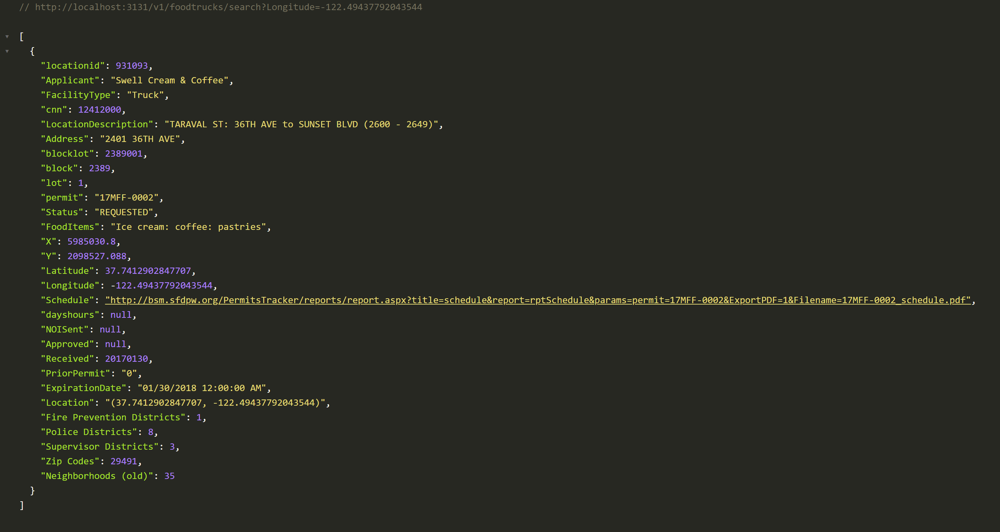
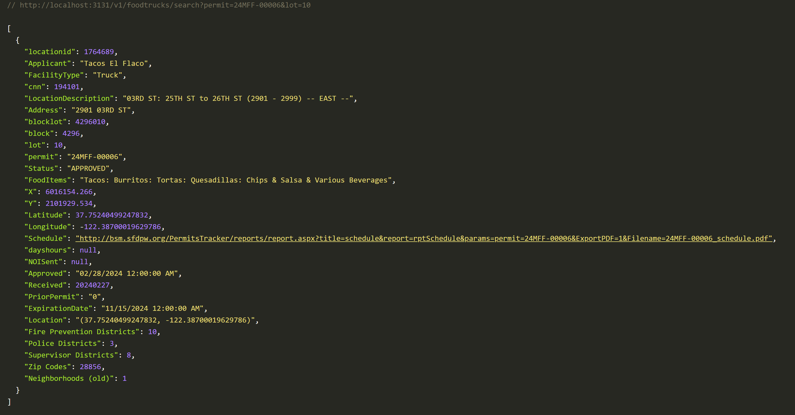

# Food Trucks API

This API provides endpoints to search for food trucks based on various criteria. Given the limited time available, I focused on core functionalities rather than secondary aspects like parsing and database integration. If I had more time, I would have delved into parsing the data more thoroughly and implemented a robust database solution to store and manage the food truck data effectively.

Additionally, the current API logic is relatively basic, primarily checking for case-insensitive string matches and exact numerical comparisons. With more time, I would enhance the API logic to handle a wider range of search criteria and offer more flexible and advanced querying options for a richer user experience.

## Installation

3. Install dependencies: `npm install`

## Configuration

1. Create a `.env` file in the root directory. (Optional)
2. Add your environment variables, e.g. `PORT=3131`. (Optional)

### Start the Server

To start the server, run:

```bash
npm start
```

### Tests

To run all the tests, run:

```bash
npm run test
```

### Endpoints

```
GET /v1/foodtrucks/search
```

Searches for food trucks based on query parameters.

### Parameters

- `query`: The search query, e.g., `?FacilityType=Push Cart&lot=001`.
- Add more parameters as needed based on the available search criteria.



